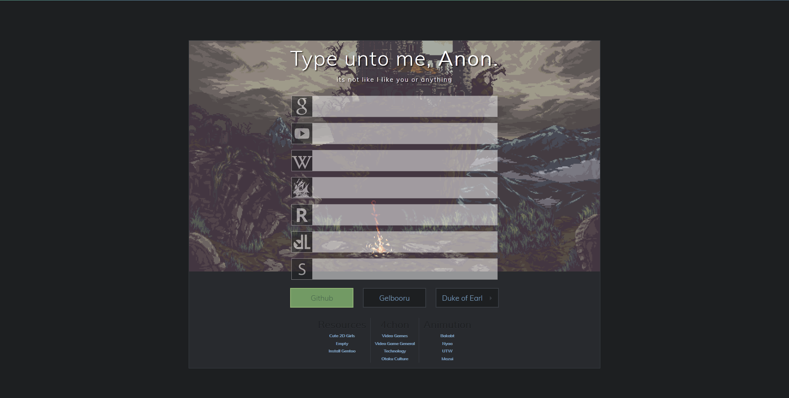

Homepage
====



**Live Demo: [Dark](http://gokoururi.github.io/homepage/) - [Light](http://gokoururi.github.io/homepage/index-light.html)**

This repository contains a custom homepage made using html, css and javascript (node.js). Feel free to download and modify. Comments and suggestions appreciated. Please don't expect too much.

Features:
* Flashy links
* Flashy Slidy sublinks
* Flashy Slidy searchbars 
* Randomly selected cute 2D girls
* Column style links.
* **New**: Light color theme. See [Live Demo](http://gokoururi.github.io/homepage/index-light.html)

Installation
----
* Click on the green "Clone or download" button and choose "Download ZIP".
* Extract the file somewhere ```I will assume it's C:\```
* Go to your browser and input ```file:///C:/homepage-master/home.index``` in the address bar.
* Customize the page by reading the section "Customizing and adding mascots".
* If the path to the home page contains spaces, replace each space with ```%20```, e.g., ```file:///C:/Program%20Files/homepage-master/home.index```


Customizing and adding mascots
----

To customize mascots modify the following values in [javascript](js/scripts.js):

```javascript
    var mascotEnable    = true;
    var mascotPath      = "images/mascots/"
    var mascotList      = [ 'ruri1.png', 'ruri2.png', 'ruri3.png' ];
```

To modify the position of the box, change the ```margin: 10vh``` value in [css/general.css](css/general.css)

To change the font of the entire page, change the ```font-family``` value in [css/general.css](css/general.css)

The variable ```mascotList``` in [js/scripts.js](js/scripts.js) must contain the file name and its extension, I think using gifs gives more flavor to the page. I've included some galleries above the variable for you to try.

I've added a bunch of search bars for my favorite websites.

Disclaimer
----
Images of cute girls were made by Anons from /w/ and stolen from their [Google Drive](https://drive.google.com/folderview?id=0B_VmbVyD4eT3N1VUbGN4Wjd5OVE).
